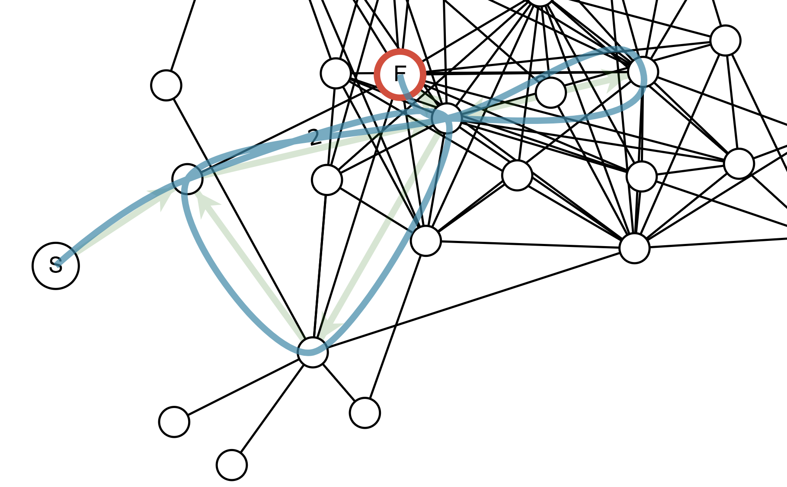

# d3-force-straighten-paths

Given a set of paths as arrays of node ids or references, and the strength associated
with each path, apply torsion spring forces to each node to attempt to straighten the
paths.

This helps with drawing paths (chains of edges) as splines. The torsion forces are
applied each time there is an angle between two consecutive edges in a path:

In the diagram, arrows represent the forces on three consecutive nodes in a
chain. Nodes **A** and **C** are pushed outward perpendicular to their respective
edges to **B**. And **B** is brought between **A** and **C** with a force equal to
the negative sum of the other two forces.

The force is proportional to the square of the difference between &#x2220;B and
&#960;&mdash;this penalizes tight angles more than angles closer to straight.

## API Reference

<a name="forceStraightenPaths" href="#forceStraightenPaths">#</a>
<b>forceStraightenPaths</b>([<i>paths</i>])

Creates a new force with the given array of
[*paths*](#forceStraightenPaths_paths). If *paths* is not specified, it defaults to
the empty array.

<a name="forceStraightenPaths_paths" href="#forceStraightenPaths_paths">#</a>
<i>straighten</i>.<b>paths</b>([<i>paths</i>])

If *paths* is specified, sets the force's paths to the specified array of
objects. For each path object,
[*straighten*.pathNodes](#forceStraightenPaths_pathNodes) will be called to get the
array of nodes, and [*straighten*.pathStrength](#forceStraightenPaths_pathStrength)
will be called to get the multiplier for the torsion strength of each of the internal
nodes on the path.

The *paths* array is not modified by `forceStraightenPaths`. If the nodes arrays
contain objects, they are assumed to be references to the nodes of the
simulation. Otherwise [*straighten*.id](#forceStraightenPaths_id) is used to build a
map of the nodes, and the nodes are used as keys into that map to get node
references.

<a name="forceStraightenPaths_id" href="#forceStraightenPaths_id">#</a>
<i>straighten</i>.<b>id</b>([id])

The function to retrieve a key for each node used to identify that
node. [*straighten*.pathNodes](#forceStraightenPaths_pathNodes) should return an
array of compatible keys. Defaults to fetching *node*.index.

<a name="forceStraightenPaths_angleForce" href="#forceStraightenPaths_angleForce">#</a>
<i>straighten</i>.<b>angleForce</b>([<i>angleForce</i>])

The constant to be multiplied by the square of the difference of the angle from
&#960; to produce the force. Default: 0.1.

<a name="forceStraightenPathNodes_pathNodes" href="#forceStraightenPaths_pathNodes">#</a>
<i>straighten</i>.<b>pathNodes</b>([<i>pathNodes</i>])

Given a path, fetches the array of nodes. Defaults to fetching *path*.nodes.

<a name="forceStraightenPaths_pathStrength" href="#forceStraightenPaths_pathStrength">#</a>
<i>straighten</i>.<b>pathStrength</b>([<i>pathStrength</i>])

Given a path, determines the strength multiplier. Defaults to fetching
*path*.strength, if it is defined, otherwise 1.

<a name="forceStraightenPaths_debug" href="#forceStraightenPaths_debug">#</a>
<i>straighten</i>.<b>debug</b>([<i>debug</i>])

Debug mode. Prints output to the console for use with [force-debugger](https://github.com/gordonwoodhull/force-debugger).
